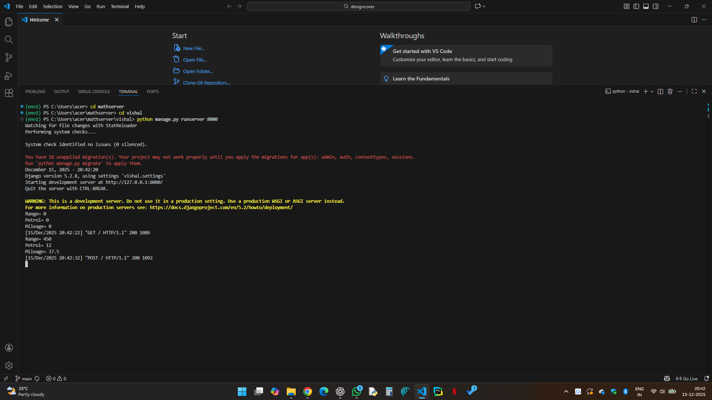
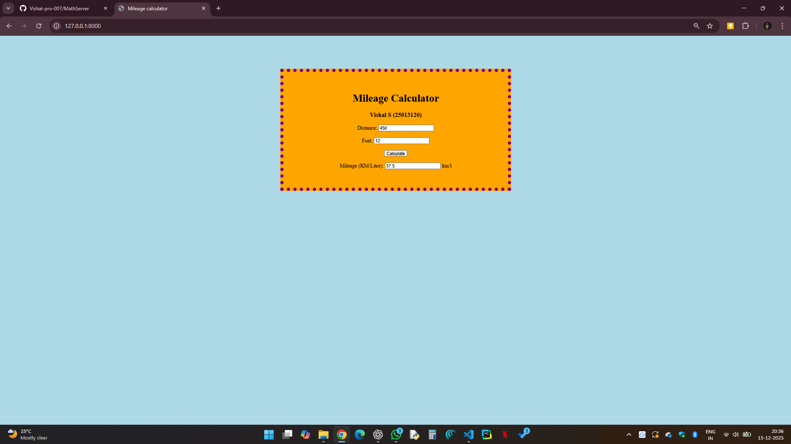

# Ex.04 Design a Website for Server Side Processing
## Date: 15.12.2025

## AIM:
To create a web page to calculate vehicle mileage and fuel efficiency using server-side scripts.

## FORMULA:
M = D / F
<br> M --> Mileage (in km/l)
<br> D --> Distance Travelled (in km)
<br> F --> Fuel Consumed (in l)

## DESIGN STEPS:

### Step 1:
Clone the repository from GitHub.

### Step 2:
Create Django Admin project.

### Step 3:
Create a New App under the Django Admin project.

### Step 4:
Create python programs for views and urls to perform server side processing.

### Step 5:
Create a HTML file to implement form based input and output.

### Step 6:
Publish the website in the given URL.

## PROGRAM:

1) Math.html
```
<html>
<head>
    <title>Mileage calculator</title>
    <style>
        body {
            background-color: lightblue;
        }
        .box {
            width: 600px;
            margin: 100px auto;
            background-color: orange;
            padding: 40px;
            border:  dotted purple 10px;
            text-align: center;
        }
    </style>
</head>

<body>
    <div class="box">
        <h1>Mileage Calculator</h1>
        <h3>Vishal S (25013120)</h3>
        <form method="POST">
            
            <label>Distance:</label>
            <input type="number" name="Range" value="{{ km }}">
            <br><br>
            <label>Fuel:</label>
            <input type="number" name="Petrol" value="{{ lit }}">
            <br><br>
            <button type="submit">Calculate</button>
            <br><br>
            <label>Mileage (KM/Litre):</label>
            <input type="number" value="{{ mileage }}" readonly> km/l
        </form>
    </div>
</body>
</html>
```

2) Views.py
```
from django.shortcuts import render
def mileage(request):
    km = int(request.POST.get('Range', 0))
    lit = int(request.POST.get('Petrol', 0))
    mileage = km / lit if request.method == 'POST' else 0
    print("Range=",km)
    print("Petrol=",lit)
    print("Mileage=",mileage)
    return render(request, 'mathapp/math.html', {'km': km, 'lit': lit, 'mileage': mileage})

```

3) urls.py
```
from django.urls import path
from mathapp import views
urlpatterns = [
    path('', views.mileage, name='mileage'),
]
```


## OUTPUT - SERVER SIDE:


## OUTPUT - WEBPAGE:


## RESULT:
The a web page to calculate vehicle mileage and fuel efficiency using server-side scripts is created successfully.
